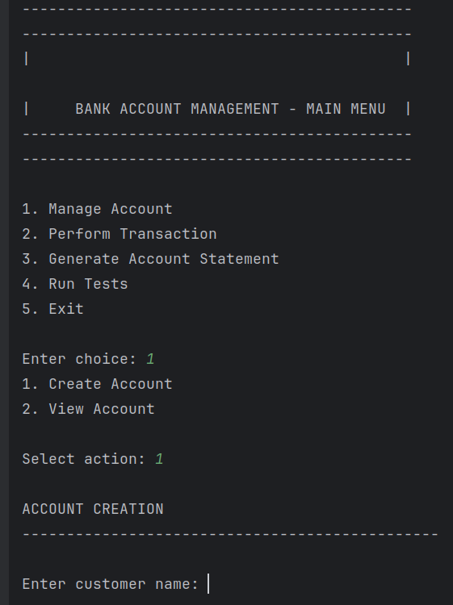
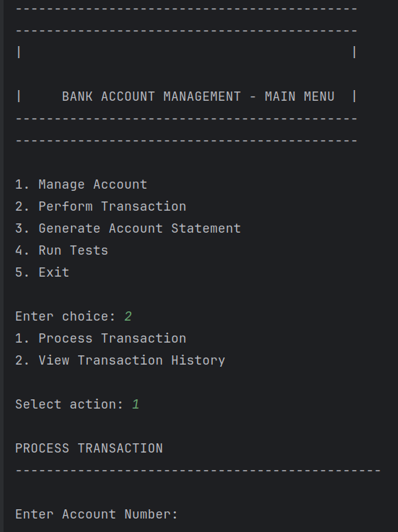
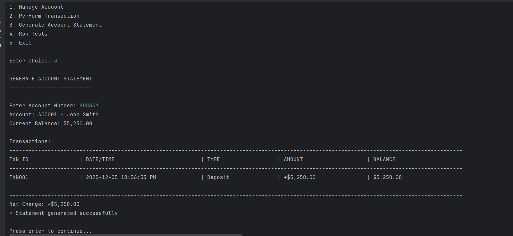

# Bank Account Management System

A **console-based Java application** built using **Object-Oriented Programming (OOP)** principles and **Maven**. The system allows users to manage basic banking operations such as creating accounts, depositing money, withdrawing funds, and viewing account information. This project was developed as part of an NSS assignment following structured requirements for OOP design and console interaction.

This repository represents Week 2 enhancements focusing on clean code practices, exception handling, unit testing with JUnit, and Git version control workflows.

---

## 📌 Features

- Create new bank accounts
- Deposit funds into an account
- Withdraw funds with balance validation
- Display account details
- Display all created accounts
- Automatically generate account IDs
- Input validation and error handling
- Clean separation of logic using OOP principles
- Custom exceptions for invalid operations (e.g., InsufficientFundsException, InvalidAccountException)
- JUnit tests for key methods like deposit, withdraw, and transfer
- Enhanced console UI with clear error messages and confirmation prompts
- In-memory transaction recording and statement generation

---

## 🎯 Learning Objectives

- Apply clean code principles for readability, maintainability, and scalability.
- Implement robust exception handling to manage invalid inputs and transaction errors.
- Write and execute unit tests with JUnit 5 for critical methods like deposit(), withdraw(), and transfer().
- Utilize Git for version control – initializing repositories, committing, branching, merging, and cherry-picking specific commits.
- Refactor Week 1 classes (Account, TransactionManager, etc.) to improve structure and reduce redundancy.
- Demonstrate code review cycles to build confidence in software changes.
- Prepare the codebase for Week 3 enhancements (Collections API and File Storage).

---

## 🛠️ Technologies Used

- **Java (JDK 17 or later)**
- **Maven** (Project build + dependency management)
- **JUnit 5** (For unit testing)
- **Java Collections (ArrayList, etc.)**
- **Scanner (Console Input/Output)**
- **SonarQube - for automated code quality and security analysis**
- **Git** (Version control with branching and merging)

---

## 📂 Project Structure

```
BankAccount/
├── docs
│   └── documentation.docx            # Documentation for the project
│   └── git-workflow.md               # Git workflow for the project
├── src/
│   └── docs/
│   └── images/
│   └── main/
│       └── java/
│           └── com.amalitech.bankaccount/
│               ├── account/          # Classes representing account types and data structures
│               ├── customer/         # Classes representing customers types and data structures
│               ├── enums/            # Enums for serving as a helpers for data types
│               ├── exceptions/       # Custom exception handlers
│               ├── interfaces/       # Interface class for implementing abstraction
│               ├── records/          # Records for collecting and transferring data among classes
│               ├── transaction/      # Transaction classes
│               ├── utils/            # Helper utilities (validation, formatting, printables, etc.)
│               └── Main.java         # Application entry point with console menu
│               └── TestRunner        # Test Runners
├── test/                             # JUnit test classes (e.g., AccountTest.java, TransactionManagerTest.java)
├── .git/                             # Git repository files
├── LICENSE                           # MIT license
├── pom.xml                           # Maven configuration file
└── README.md                         # Project documentation
```

---

## 🚀 Getting Started

### **1. Prerequisites**

Before running the program, ensure you have:
- Java **17+**
- Maven **4.0+**
- Git installed

### **2. Clone the Repository**

```bash
git clone https://github.com/gideondakore/BankManagementCleanCodeTestingAndGit.git
cd BankManagementCleanCodeTestingAndGit
mvn clean install
# OR
mvn compile
java -cp target/classes Main
```

### **3. Running Tests**

To run the JUnit tests:

```bash
mvn test
```

This will execute unit tests for deposit, withdrawal, and other key functionalities, logging results to the console.

---

## 📘 How the System Works

When the application starts, you will see a menu such as:

```
--------------------------------------------
|                                          |
|   BANK ACCOUNT MANAGEMENT SYSTEM         |
|                                          |
--------------------------------------------

1. Manage Accounts
2. Perform Transactions
3. Generate Account Statement
4. Run Tests
5. Exit
```

Each option executes a corresponding service method, such as: handleCreateAccount(), viewAllAccounts(), processTransaction(), viewTransactionHistory()

The system stores all account data temporarily in memory using Java collections.

## 🔄 Git Workflow

This project demonstrates Git version control practices, including branching for features, committing changes, merging, and cherry-picking. The workflow follows a feature-branch model to isolate development of clean code refactoring, exception handling, and testing.

### Branches Used
- **main**: Default branch for stable code.
- **feature/refactor**: For code refactoring and clean design improvements.
- **feature/exceptions**: For implementing custom exceptions and error handling.
- **feature/error-handling**: For enhanced error validation and try-catch blocks.
- **feature/testing**: For adding JUnit tests.

### Key Commit History (Recent Examples)
Here are some key commits showing the progression (hashes abbreviated for brevity):

- **0d8e7e0** (Dec 5, 2025): Merge branch 'feature/testing' to main
- **0b6aa93** (Dec 5, 2025): Merge branch 'feature/error-handling' to main
- **51392ae** (Dec 5, 2025): Added test for withdrawal and deposit
- **a2dd484** (Dec 5, 2025): Cherry pick the commit of removing same code in subclass of Account to the Account parent class to feature/refactor
- **cd70412** (Dec 5, 2025): Generated Test for the Account class
- **7c737a3** (Dec 5, 2025): Add javadocs to transaction
- **75ec6d1** (Dec 5, 2025): Include javadocs in the Account Management
- **73f86dd** (Dec 5, 2025): Resolve merge conflict in Withdraw method
- **1637e41** (Dec 5, 2025): Add javadoc to Account and it subclasses
- **96af49c** (Dec 5, 2025): Update the exit app exit message

### Example Git Commands Used in Development
Based on the project's implementation phases:

1. `git init` - Initialize the Git repository.
2. `git add .` - Stage initial files.
3. `git commit -m "Initial refactoring for clean code"` - Commit refactored code.
4. `git branch feature/testing` - Create a branch for testing.
5. `git checkout feature/testing` - Switch to the testing branch.
6. `git commit -m "Add Unit tests for transactions"` - Commit tests.
7. `git checkout main` - Switch back to main.
8. `git cherry-pick <commit-hash>` - Cherry-pick specific commits (e.g., tests) from feature branches.
9. `git merge feature/error-handling` - Merge completed feature branches.
10. `git push origin main` - Push changes to remote repository.

This workflow ensures isolated development, easy integration, and selective application of changes via cherry-pick.

---

## 🛡️ Project Requirements

This project meets the following requirements from the assignment:

### System Features
1. **Refactored Account and Transaction Classes**: Simplified methods with clear names, comments, modular design, and helper methods (e.g., validateAmount()).
2. **Error Handling and Validation**: Try-catch blocks for invalid inputs, custom exceptions (e.g., InsufficientFundsException), prevent overdrafts and invalid amounts.
3. **Transaction Testing and Verification**: JUnit tests for deposit(), withdraw(), transfer(); validate balances and exceptions; log results to console.
4. **Git Version Control Integration**: Branches for features, merges, cherry-picks for controlled changes.
5. **Enhanced Console User Experience**: Clear error messages, transaction confirmations, simulated test outputs.

### Implementation Phases
- **Phase 1: Setup and Refactoring** (1-2 hours): Fork repo, create feature/refactor branch, refactor Account and TransactionManager for clarity, add JavaDocs.
- **Phase 2: Exception Handling** (1 hour): Create custom exceptions, wrap validations in try-catch, update UI for graceful errors.
- **Phase 3: Testing and Verification** (2 hours): Add JUnit 5, write tests for deposit/withdraw/transfer, run and document results.
- **Phase 4: Merge and Documentation**: Merge branches, resolve conflicts, document Git workflow in README, submit repo.

### Minimum Requirements Checklist
- All custom exceptions implemented.
- JUnit tests created and passing.
- Code refactored for clean structure.
- Git repository initialized with branching and cherry-pick usage.
- README includes Git workflow and test results.
- All Week 1 features are still functional.

### Test Scenarios
- **Account Creation**: Verify auto-generated IDs, formatted messages.
- **Deposit with Exception**: Invalid amount throws exception with user-friendly message.
- **Withdrawal and Overdraft**: Successful withdrawal, overdraft throws OverdraftExceededException.
- **Statement Generation**: Formatted output with sorted transactions, totals.
- **Input Handling**: Handle invalid choices with custom exceptions.
- **Run JUnit Tests**: All tests pass, assertions for balances and exceptions.
- **Git Cherry-Pick**: Switch branches, cherry-pick commits, push to main.

---

## 👤 Author

Gideon Dakore  
GitHub: https://github.com/gideondakore

## 📸 Screen Shots



## 📐 Project UML Diagram

